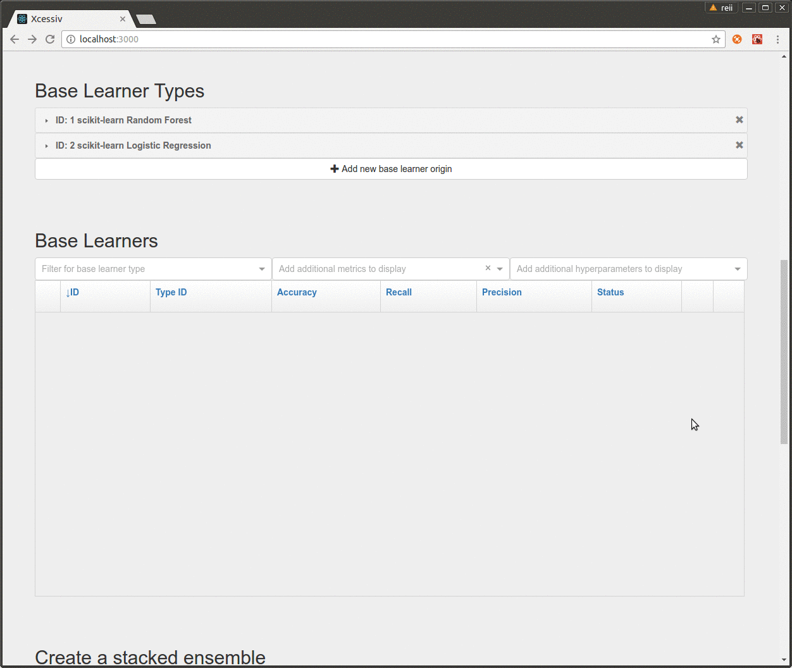
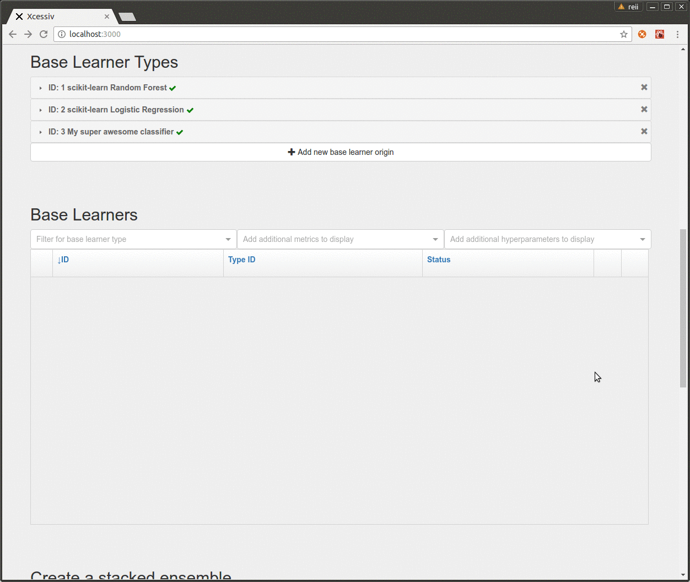
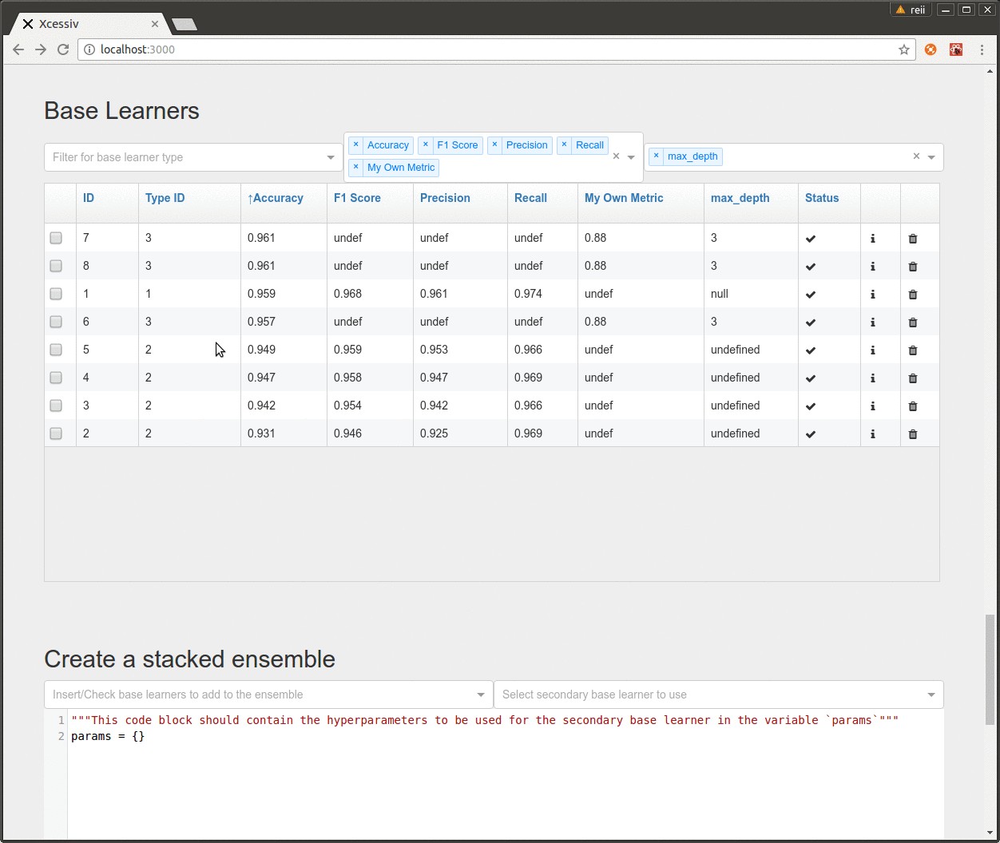

# Xcessiv

### Xcessiv is a tool to help you create the biggest, craziest, and most *excessive* stacked ensembles you can think of.

Stacked ensembles are simple in theory. You combine the predictions of smaller models and feed *those* into another model. However, in practice, implementing them can be a major headache.

Xcessiv holds your hand through all the implementation details of creating and optimizing stacked ensembles so you're free to fully define only the things you care about.

## The Xcessiv process

### Define your base learners and performance metrics

### Keep track of hundreds of different model-hyperparameter combinations

### Effortlessly choose your base learners and create an ensemble with the click of a button

## Installation

I wish I could say you can just type in `pip install xcessiv`. I really do.

Unfortunately, Xcessiv requires a bit more than that. Head on over to the official documentation for installation instructions.

## Documentation

The official documentation is located here.

## FAQ

#### Where does Xcessiv fit in the machine learning process?

Xcessiv fits in the model building part of the process after data preparation and feature engineering. At this point, there is no universally acknowledged way of determining which algorithm will work best for a particular dataset (see [No Free Lunch Theorem](https://en.wikipedia.org/wiki/No_free_lunch_theorem)), and things often break down into trial and error. Xcessiv aims to make this trial and error part as painless as possible.

#### I don't care about fancy stacked ensembles and what not, should I still use Xcessiv?

Absolutely! Even without the ensembling functionality, the sheer amount of utility provided by keeping track of the performance of hundreds, and even thousands of ML models and hyperparameter combinations is a huge boon.

#### How does Xcessiv generate meta-features for stacking?

You can choose whether to generate meta-features through cross-validation (stacked generalization) or with a holdout set (blending). You can read about these two methods and a lot more in the [Kaggle Ensembling Guide](https://mlwave.com/kaggle-ensembling-guide/).

## Project Status

Xcessiv is currently in pre-release and is unstable. Future versions are not guaranteed to be backwards-compatible with current project files.
