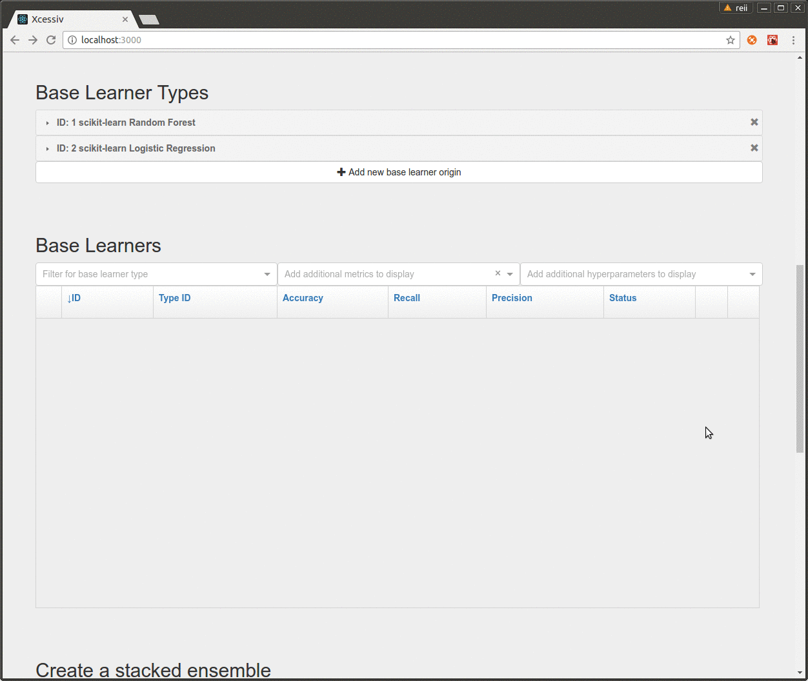

# Xcessiv

### Xcessiv is a tool to help you create the biggest, craziest, and most *excessive* stacked ensembles you can think of.

Stacked ensembles are simple in theory. You combine the predictions of smaller models and feed *those* into another model. However, in practice, implementing them can be a major headache.

Xcessiv holds your hand through all the implementation details of creating and optimizing stacked ensembles so you're free to fully define only the things you care about.

## The Xcessiv process

### Define your base learners and performance metrics

### Keep track of hundreds of different model-hyperparameter combinations

### Effortlessly choose your base learners and create an ensemble with the click of a button

## Features

* Fully define your data source, cross-validation process, relevant metrics, and base learners with Python code
* Any model following the Scikit-learn API can be used as a base learner
* Task queue based architecture lets you take full advantage of multiple cores and embarrassingly parallel hyperparameter searches
* Direct integration with [TPOT](https://github.com/rhiever/tpot) for automated pipeline construction
* Automated hyperparameter search through Bayesian optimization
* Easy management and comparison of hundreds of different model-hyperparameter combinations
* Automatic saving of generated secondary meta-features
* Stacked ensemble creation in a few clicks
* Export your stacked ensemble as a standalone Python file to support multiple levels of stacking

## Installation and Documentation

You can find installation instructions and detailed documentation hosted [here](http://xcessiv.readthedocs.io/).

## FAQ

#### Where does Xcessiv fit in the machine learning process?

Xcessiv fits in the model building part of the process after data preparation and feature engineering. At this point, there is no universally acknowledged way of determining which algorithm will work best for a particular dataset (see [No Free Lunch Theorem](https://en.wikipedia.org/wiki/No_free_lunch_theorem)), and while heuristic optimization methods do exist, things often break down into trial and error as you try to find the best model-hyperparameter combinations. 

Stacking is an almost surefire method to improve performance beyond that of any single model, however, the complexity of proper implementation often makes it impractical to apply them in practice outside of Kaggle competitions. Xcessiv aims to make the construction of stacked ensembles as painless as possible and lower the barrier for entry.

#### I don't care about fancy stacked ensembles and what not, should I still use Xcessiv?

Absolutely! Even without the ensembling functionality, the sheer amount of utility provided by keeping track of the performance of hundreds, and even thousands of ML models and hyperparameter combinations is a huge boon.

#### How does Xcessiv generate meta-features for stacking?

You can choose whether to generate meta-features through cross-validation (stacked generalization) or with a holdout set (blending). You can read about these two methods and a lot more about stacked ensembles in the [Kaggle Ensembling Guide](https://mlwave.com/kaggle-ensembling-guide/). It's a great article and provides most of the inspiration for this project.

## Contributing

Xcessiv is in its very early stages and needs the open-source community to guide it along. 

There are many ways to contribute to Xcessiv. You could report a bug, suggest a feature, submit a pull request, improve documentation, and many more. 

If you would like to contribute something, please visit our [Contributor Guidelines](CONTRIBUTING.md).

## Project Status

Xcessiv is currently in alpha and is unstable. Future versions are not guaranteed to be backwards-compatible with current project files.
