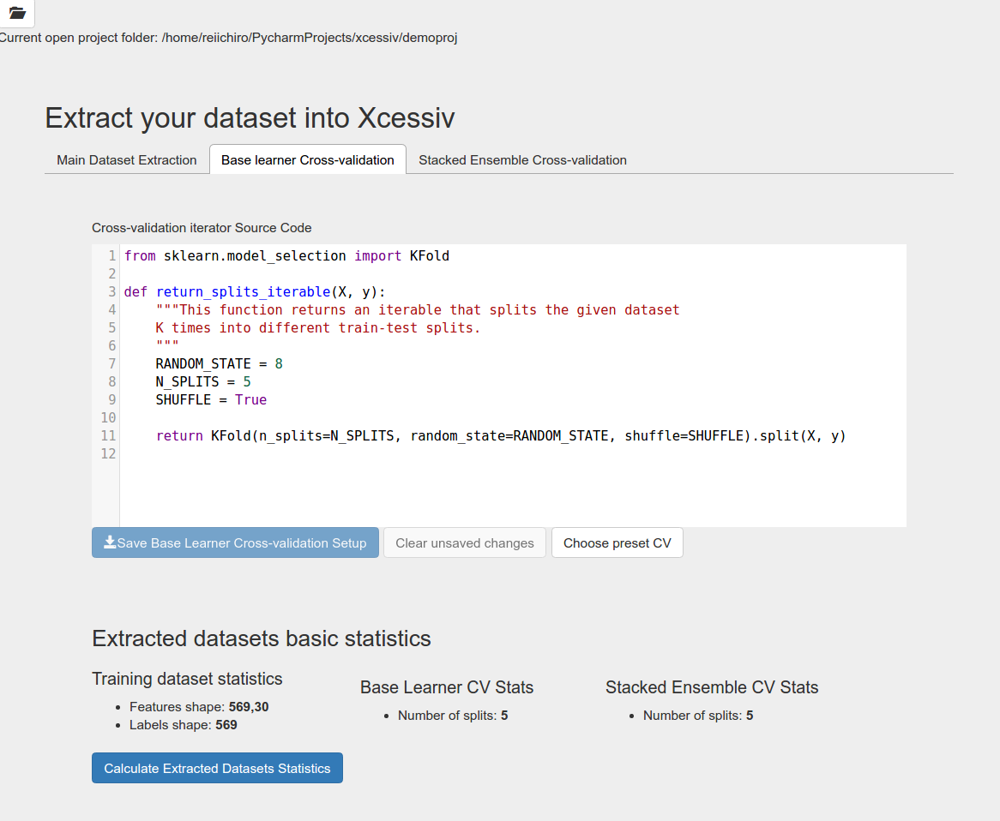

Walkthrough of Typical Xcessiv Workflow
=======================================

This guide aims to demonstrate the power and flexibility of Xcessiv by walking you through a typical Xcessiv workflow. We'll optimize our performance on the breast cancer sample dataset that comes with the scikit-learn library.

Starting Xcessiv
----------------

First, make sure your Redis server is up and running. In most cases, Redis will be running at its default port of 6379.

Open up your terminal and move to your working directory. Let's make a directory called XcessivProjects and move inside it::

   mkdir XcessivProjects
   cd XcessivProjects

XcessivProjects will contain all projects we create with Xcessiv.

To run Xcessiv in the current directory, we simply run::

   xcessiv

This will run the Xcessiv server and a single worker process with the default settings. You can view the Xcessiv application by pointing your browser at localhost:1994 by default.

To view the full range of settings you can configure using the command line, type::

   xcessiv -h

For example, to run the Xcessiv server along with 3 separate worker processes, run::

   xcessiv -w 3

.. admonition:: A note about worker processes

   Xcessiv doesn't do the heavy processing in its application server. Instead, Xcessiv hands the jobs off to separate RQ worker processes. If you have more than one worker process running, then you will be able to process jobs in parallel without any additional configuration. However, keep in mind that each worker will consume its own CPU and memory. The optimal number of workers will then depend on your dataset size, number of cores, and available system memory.

Creating/Opening a Project
--------------------------

When you open Xcessiv for the first time, you'll see a plain screen and a single button. Click on the button to open the ``Create New Project`` modal. This modal provides all functionality needed to create and open an Xcessiv project.

.. image:: _static/create_open_project.png
   :align: center
   :alt: Create/Open Project Modal

Since XcessivProjects is an empty folder, we won't see any existing projects yet. Create a new project then open it.

Now would be a good time to explain the structure of an Xcessiv project. An Xcessiv project is essentially a folder with a SQLite database and a sub-folder for storing saved meta-features. When you want to share your project with other people, all you need to do is give them a copy of this folder and they will be able to open it using their own Xcessiv installation. Keep in mind that this folder might get very big for large projects with a large number of saved meta-features.

Importing your dataset into Xcessiv
-----------------------------------

After opening your new project, the first thing to do is to define your dataset.

Define the main dataset
~~~~~~~~~~~~~~~~~~~~~~~

First, we must define the main dataset.

.. image:: _static/main_data_extraction.png
   :align: center
   :alt: Main Data Extraction

In the code block shown, you must define a function ``extract_main_dataset`` that takes no arguments and returns a tuple ``(X, y)``, where ``X`` is a Numpy array with shape ``(n_samples, n_features)`` corresponding to the features of your main dataset and ``y`` is the Numpy array corresponding to the ground truth labels of each sample.

Experienced **scikit-learn** users will recognize this format as the one accepted by **scikit-learn** estimators. As a project heavily influenced by the wonderful **scikit-learn** API, this is a theme that will come up repeatedly when using Xcessiv.

Since we're going with the breast cancer sample dataset that comes with scikit-learn, copy the following code into the Main Dataset Extraction code block.::

   from sklearn.datasets import load_breast_cancer

   def extract_main_dataset():
       X, y = load_breast_cancer(return_X_y=True)
       return X, y

Xcessiv gives you the flexibility to extract your dataset any way you want with whatever packages are included in your Python installation. You can open up the quintessential csv file with **pandas**. Or directly download the data from Amazon S3 with **boto**. As long as ``extract_main_dataset`` returns the proper format of your data, any way convenient for you will do. One important thing to keep in mind here is that for every process that needs your data, Xcessiv will call ``extract_main_dataset``. Keeping this function as light as possible is recommended.

Save your dataset extraction code and click the **Calculate Extracted Datasets Statistics** button. This will look for the ``extract_main_dataset`` function in your provided code block and display the shape of ``X`` and ``y``. This is a good way to confirm if your code works properly.

Confirm that ``X`` (Features array) has a shape of ``(569, 30)`` and ``y`` (Labels array) has a shape of ``(569,)``.

Define the meta-feature generation method
~~~~~~~~~~~~~~~~~~~~~~~~~~~~~~~~~~~~~~~~~

After defining the main dataset, we must define how Xcessiv extracts meta-features for training the secondary classifier. Meta-features are the term used for new features generated by the base learners that are used by the second-level learner. In most cases, this can be the actual predictions or the output probabilities of each class.

For stacked ensembles, there are two main ways to extract meta-features: cross-validation to get out-of-fold predictions for every sample in the dataset, or having a separate holdout set to generate the meta-features (blending). The difference between the two can be found at the `Kaggle ensembling guide <https://mlwave.com/kaggle-ensembling-guide/>`_

For now, all you need to know is that using cross-validation will allow you to use your whole training set for training the secondary learner at the expense of added computational complexity while using a holdout set will only train the secondary learner on the meta-features generated from that holdout set.

Therefore, for smaller datasets, cross-validation is preferred while for larger datasets, you should use a holdout set.

Since the breast cancer dataset has only 569 samples, we should use cross-validation. From the drop-down list, select **Stratified Cross-validation** and select the number of folds and random seed. The random seed is required for deterministic generation of the folds when using different base learners.

Let's keep the number of folds and random seed at the defaults of 5 and 8, respectively.

If you wish to use a separate holdout set, Xcessiv gives you the option of automatically splitting one from the main dataset or defining another function ``extract_holdout_dataset`` with the same signature as ``extract_main_dataset``.

If you click again on **Calculate Extracted Datasets Statistics**, you will notice that the holdout dataset statistics are undefined. This is because when we do cross-validation, a holdout set is not generated.

Defining your base learners and metrics
---------------------------------------

.. image:: _static/base_learner_origin.png
   :align: center
   :alt: Base learner origins

When you're satisfied with your dataset extraction and meta-feature generation setup, the next step is to define your base learners and the metrics by which you will judge the performance of each base learner.

In Xcessiv, a base learner is an *instance of a class* with the methods ``fit``, ``get_params``, and ``set_params``.

Again, **scikit-learn** users will recognize that these are methods common across all **scikit-learn** estimators. In Xcessiv, all **scikit-learn** estimators can be used straight out of the box with no extra configuration. This is a good thing as well even if you wish to use algorithms from external libraries such as **XGBoost** or **Keras**, as these libraries often have **scikit-learn** compatible wrappers around their core estimators e.g. :class:`XGBoostClassifier`, :class:`KerasClassifier`.

Use a basic scikit-learn estimator
~~~~~~~~~~~~~~~~~~~~~~~~~~~~~~~~~~

Let's begin by defining a classic **scikit--learn** estimator, the :class:`sklearn.ensemble.RandomForestClassifier`.

Click the **Add new base learner origin** button to define a new base learner.

Rename the default name **Base Learner Setup** to **Scikit-learn Random Forest**. Then, copy the following code into the code block then save.::

   from sklearn.ensemble import RandomForestClassifier

   base_learner = RandomForestClassifier(random_state=8)

All it takes to define the base learner is to assign an *instance of your estimator class* to the variable ``base_learner``.

You will notice that we initialized the Random Forest's ``random_state`` parameter with a value of 8. We want ``base_learner`` initialized with the default parameters we want it to have.

Why ``random_state``? Since we will be storing the performance of our base learners, we want any estimators with a randomized element to run the same way every time. Estimators with the same hyperparameters except for the random seed should still be considered different estimators. It is good practice to set any random seeds in ``base_learner`` with a deterministic value

Use the scikit-learn pipeline object for more advanced estimators
~~~~~~~~~~~~~~~~~~~~~~~~~~~~~~~~~~~~~~~~~~~~~~~~~~~~~~~~~~~~~~~~~

An incredibly useful tool for chaining together different transformers and estimators is the **scikit-learn** :class:`sklearn.pipeline.Pipeline` object. If you want an in-depth guide to pipelines, see http://scikit-learn.org/stable/modules/pipeline.html.

Create another base learner origin, rename it to **PCA + Random Forest**, and copy the following code into the code block then save.::

   from sklearn.pipeline import Pipeline
   from sklearn.ensemble import RandomForestClassifier
   from sklearn.decomposition import PCA

   estimators = [('pca', PCA(random_state=8)), ('rf', RandomForestClassifier(random_state=8))]
   base_learner = Pipeline(estimators)

Here we've defined a pipeline of PCA followed by Random Forest and assigned it to ``base_learner``. This is now considered a single base learner type whose hyperparameters are a combination of PCA hyperparameters and Random Forest hyperparameters.

Again, notice how we've initialized all random seeds to a fixed value.

Predefined base learners
~~~~~~~~~~~~~~~~~~~~~~~~

Xcessiv contains predefined base learners for the some of the more common base learners such as Random Forest and Logistic Regression.

You can click the **Choose preset learner setting** button to view and use predefined base learners.

Define the meta-feature generator method for a base learner
~~~~~~~~~~~~~~~~~~~~~~~~~~~~~~~~~~~~~~~~~~~~~~~~~~~~~~~~~~~

Up to now we've defined estimators that have ``fit`` methods for training on a train data set, and ``get_params`` and ``set_params`` for getting and setting hyperparameters, respectively.

But we haven't yet defined what method base learners use to generate the meta-features. For classifiers, the most common way to generate meta-features is either ``predict`` or ``predict_proba``.  By default, Xcessiv sets the meta-feature generator method to ``predict_proba``.

For estimators that don't have the ``predict_proba`` method, you can change the meta-feature generator to whatever you want. For example, for SVM classifiers, it is recommended to use ``decision_function`` instead of ``predict_proba`` because of the additional computational complexity in when probabilities are generated.

Whatever you choose to be the meta-feature generator method, it must take a single variable ``X``, where ``X`` is an array-like object of shape ``(n_samples, n_features)``, and return a Numpy array of shape ``(n_samples,)`` or ``(n_samples, num_meta_features)``, where ``num_meta_features`` is a positive integer referring to the number of meta-features generated per sample e.g. 5 for ``predict_proba`` in a dataset with 5 unique classes. In other words, the estimator must take every sample and decompose it into a single meta-feature e.g. ``predict``, or a set of meta-features e.g. ``predict_proba``.

This flexibility allows you to do things like using regressors as base learners for classifier ensembles, or even PCA-transformed features as meta-features.

Define your metrics
~~~~~~~~~~~~~~~~~~~

To quantify the "goodness" of a base learner, we'll need to define metrics to evaluate the quality of its generated meta-features.

For classifiers, very common metrics include Accuracy, Recall, and Precision. For regression, a useful metric is Mean Squared Error.

Other important metrics include the Area Under Curve of the Receiver Operating Characteristic (AUC-ROC) or the Brier Score, both of which can be calculated through the class probabilities output of a classifier.

Let's define an Accuracy metric for our Random Forest base learner.

Click the **Add new metric generator** button. Name it Accuracy. In the resulting code block, add in the following code and save::

   from sklearn.metrics import accuracy_score
   import numpy as np

   def metric_generator(y_true, y_probas):
       """This function computes the accuracy given the true labels array (y_true)
       and the scores/probabilities array (y_probas) with shape (num_samples, num_classes).
       For the function to work correctly, the columns of the probabilities array must
       correspond to a sorted set of the unique values present in y_true.
       """
       classes_ = np.unique(y_true)
       if len(classes_) != y_probas.shape[1]:
           raise ValueError('The shape of y_probas does not correspond to the number of unique values in y_true')
       argmax = np.argmax(y_probas, axis=1)
       y_preds = classes_[argmax]
       return accuracy_score(y_true, y_preds)

To define a metric, you must define a function ``metric_generator`` that takes two arguments. The first argument should take an array-like object referring to the set of true labels, in this case, ``y_true``, with shape ``(num_samples,)``. The second argument should take an array-like object with shape ``(num_samples, num_meta_features)`` corresponding to the generated meta-features per sample, ``y_probas``. The value returned should be the calculated value of the particular metric.

The function above calculates the Accuracy metric from the ground truth classes and a set of class probabilities returned by a classifier.

In the case our meta-feature generator method is set to ``predict``, this is the correct code for calculating Accuracy::

   from sklearn.metrics import accuracy_score

   metric_generator = accuracy_score

Like predefined base learners, Xcessiv comes with a bunch of preset metric generators for some commonly-used metrics. You can use and reuse these for the most common use cases instead of writing your own function every time you define a base learner.

You can add as many valid metrics as you want. These will be calculated everytime the base learner is processed. Let's go ahead and add the preset metric generators "Recall from Scores/Probabilities", "Precision from Scores/Probabilities", and "F1 Score from Scores/Probabilities" with the **Add preset metric generator** button.

Save your changes.

Verify your base learner definitions and metrics
~~~~~~~~~~~~~~~~~~~~~~~~~~~~~~~~~~~~~~~~~~~~~~~~

After defining your base learners and evaluation metrics, we'll want to ensure they work as expected.

Xcessiv provides a **Verify on toy data** button that takes your base learner and calculates its metrics on a small sample dataset.

You can choose between testing it on multiclass data or binary class data. Since we'll be using our estimator on the breast cancer dataset, which is binary, we'll want to verify it works on binary class data. Click the **Verify on toy data** button and select **Binary data**. If nothing went wrong with your setup, you'll be able to see your base learner's hyperparameters with their default values, and the base learner's metrics on the sample binary data.

.. image:: _static/verified_base_learner.png
   :align: center
   :alt: Verified base learner origin

Finalize your base learner
~~~~~~~~~~~~~~~~~~~~~~~~~~

Once you're happy with your base learner and metrics, there is one last step before you can start testing it on actual data: finalization.

Finalizing locks your base learner setup, after which you will no longer be allowed to make any changes to it. This ensures consistency during the generation of meta-features and metrics while optimizing hyperparameters and creating stacked ensembles.

After finalization, your base learner setup should look like this.

.. image:: _static/finalized_base_learner.png
   :align: center
   :alt: Finalized base learner origin

At this point, feel free to create and play around with different learners and metrics. Make sure to verify and finalize all your base learners so you can use them in the next step.
