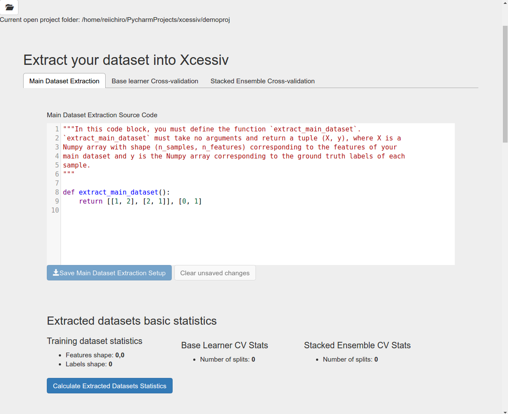

Walkthrough of Typical Xcessiv Workflow
=======================================

This guide aims to demonstrate the power and flexibility of Xcessiv by walking you through a typical Xcessiv workflow. We'll optimize our performance on the breast cancer sample dataset that comes with the scikit-learn library.

Starting Xcessiv
----------------

First, make sure your Redis server is up and running. In most cases, Redis will be running at its default port of 6379.

Open up your terminal and move to your working directory. Let's make a directory called XcessivProjects and move inside it::

   mkdir XcessivProjects
   cd XcessivProjects

XcessivProjects will contain all projects we create with Xcessiv.

To run Xcessiv in the current directory, we simply run::

   xcessiv

This will run the Xcessiv server and a single worker process with the default configuration. You can view the Xcessiv application by pointing your browser at localhost:1994 by default.

To view the full range of configuration variables you can configure using the command line, type::

   xcessiv -h

For example, to run the Xcessiv server along with 3 separate worker processes, run::

   xcessiv -w 3

.. admonition:: A note about worker processes

   Xcessiv doesn't do the heavy processing in its application server. Instead, Xcessiv hands the jobs off to separate RQ worker processes. If you have more than one worker process running, then you will be able to process jobs in parallel without any additional configuration. However, keep in mind that each worker will consume its own CPU and memory. The optimal number of workers will then depend on your dataset size, number of cores, and available system memory.

Creating/Opening a Project
--------------------------

When you open Xcessiv for the first time, you'll see a plain screen and a single button. Click on the button to open the ``Create New Project`` modal. This modal provides all functionality needed to create and open an Xcessiv project.

.. image:: _static/create_open_project.png
   :align: center
   :alt: Create/Open Project Modal

Since XcessivProjects is an empty folder, we won't see any existing projects yet. Create a new project then open it.

Now would be a good time to explain the structure of an Xcessiv project. An Xcessiv project is essentially a folder with a SQLite database and a sub-folder for storing saved meta-features. When you want to share your project with other people, all you need to do is give them a copy of this folder and they will be able to open it using their own Xcessiv installation. Keep in mind that this folder might get very big for large projects with a large number of saved meta-features.

Importing your dataset into Xcessiv
-----------------------------------

After opening your new project, the first thing to do is to define your dataset.

Define the main dataset
~~~~~~~~~~~~~~~~~~~~~~~

First, we must define the main dataset.

In the code block shown, you must define a function :func:`extract_main_dataset` that takes no arguments and returns a tuple ``(X, y)``, where ``X`` is a Numpy array with shape ``(n_samples, n_features)`` corresponding to the features of your main dataset and ``y`` is the Numpy array corresponding to the ground truth labels of each sample.

Experienced **scikit-learn** users will recognize this format as the one accepted by **scikit-learn** estimators. As a project heavily influenced by the wonderful **scikit-learn** API, this is a theme that will come up repeatedly when using Xcessiv.

Since we're going with the breast cancer sample dataset that comes with scikit-learn, copy the following code into the Main Dataset Extraction code block.::

   from sklearn.datasets import load_breast_cancer

   def extract_main_dataset():
       X, y = load_breast_cancer(return_X_y=True)
       return X, y

Xcessiv gives you the flexibility to extract your dataset any way you want with whatever packages are included in your Python installation. You can open up the quintessential csv file with **pandas**. Or directly download the data from Amazon S3 with **boto**. As long as :func:`extract_main_dataset` returns the proper format of your data, any way convenient for you will do. One important thing to keep in mind here is that for every process that needs your data, Xcessiv will call :func:`extract_main_dataset`. Keeping this function as light as possible is recommended.

Save your dataset extraction code and click the **Calculate Extracted Datasets Statistics** button. This will look for the :func:`extract_main_dataset` function in your provided code block and display the shape of ``X`` and ``y``. This is a good way to confirm if your code works properly.

Confirm that ``X`` (Features array) has a shape of ``(569, 30)`` and ``y`` (Labels array) has a shape of ``(569,)``.

Define the base learner cross-validation method
~~~~~~~~~~~~~~~~~~~~~~~~~~~~~~~~~~~~~~~~~~~~~~~

After defining the main dataset, we must define how Xcessiv does cross-validation for its base learners. In Xcessiv, the base learner cross-validation's purpose is two-fold.

First, the cross-validation method is used to calculate the model-hyperparameter combination's relevant evaluation metrics on the data. Experienced users will recognize this as the usual purpose of cross-validation in machine learning.

Second, the cross-validation method is used to generate the meta-features. Meta-features are the term used for new features generated by the base learners that are used by the second-level learner in stacked ensembling. In most cases, this can be the actual predictions or the output probabilities of each class.

.. image:: _static/meta_feature_extraction.png
   :align: center
   :alt: Meta-features Extraction

For stacked ensembles, there are two main ways to extract meta-features: cross-validation to get out-of-fold predictions for every sample in the dataset, or having a single train-test split to generate the meta-features (blending). The difference between the two can be found at the `Kaggle ensembling guide <https://mlwave.com/kaggle-ensembling-guide/>`_

For now, all you need to know is that using full cross-validation will allow you to use your whole training set for training the secondary learner at the expense of added computational complexity while using a single train-test split will only train the secondary learner on the meta-features generated from that test split.

Therefore, for smaller datasets, cross-validation is preferred while for larger datasets where computational cost is a real factor, you should use a single train-test split.

Since the breast cancer dataset has only 569 samples, we will use cross-validation. In the code block shown, copy the following code.::

   from sklearn.model_selection import StratifiedKFold

   def return_splits_iterable(X, y):
       """This function returns an iterable that splits the given dataset
       K times into different stratified train-test splits.
       """
       RANDOM_STATE = 8
       N_SPLITS = 5
       SHUFFLE = True

       return StratifiedKFold(n_splits=N_SPLITS, random_state=RANDOM_STATE, shuffle=SHUFFLE).split(X, y)

Xcessiv gives you the flexibility to generate cross-validation folds however method you want to. To define a cross-validation method, you must define a function :func:`return_splits_iterable` that takes two arguments ``X`` and ``y``. These arguments will be passed the ``X`` and ``y`` variables returned from the previously defined :func:`extract_main_dataset` function. :func:`return_splits_iterable` will then return an iterator that yields a pair of indices for each train-test split it generates. Again, this is a concept taken straight out of the **scikit-learn** API and as such, most built-in cross-validation iterators from **scikit-learn** will work. See http://scikit-learn.org/stable/modules/cross_validation.html#cross-validation-iterators for the details.

.. admonition:: A note about random seeds

   It is extremely important that the folds generated by :func:`return_splits_iterable` are deterministic. Otherwise, ensembling will not work correctly. Therefore, for any cross-validation iterator that depends on a random state, make sure to set it in the function as well.

The given code does stratified K-Fold validation with 5 train-test splits and a random seed set at 8.

So far, we have given code for defining cross-validation. What if we wanted to do a simple train-test split for generating meta-features (blending)? In that case, it is interesting to note that a single train-test split can be defined by a cross-validation iterator that yields only one pair of indices for a train-test split. You can use either :class:`sklearn.model_selection.ShuffleSplit` or :class:`sklearn.model_selection.StratifiedShuffleSplit` with ``n_splits`` set to 1 for this functionality. Or, roll your own implementation.

If you click again on **Calculate Extracted Datasets Statistics**, you will notice that the base learner cross-validation statistics will show you the number of splits generated.

Since most problems will rely on very common cross-validation methods, Xcessiv provides several preset :func:`return_splits_iterable` implementations based on existing **scikit-learn**  cross-validation iterators.

Define the stacked ensemble cross-validation method
~~~~~~~~~~~~~~~~~~~~~~~~~~~~~~~~~~~~~~~~~~~~~~~~~~~

Since the secondary learner of a stacked ensemble is trained on a different set of features (the meta-features), it is natural to define a separate cross-validation method for it. Under the **Stacked Ensemble Cross-validation** tab, we see a field extremely similar to the one we found in the previous step.

In fact, to define your cross-validation method for the secondary learner, you also need to define a function :func:`return_splits_iterable` with the exact same function signature as before. Keep in mind though, that the ``X`` and ``y`` arrays passed to this function will be from the meta-features.

In most use cases and for valid comparison with the base learner metrics, you can just use the exact same cross-validation method you used for the base learners.

Go ahead and copy the exact same code we used previously into this code block.::

   from sklearn.model_selection import StratifiedKFold

   def return_splits_iterable(X, y):
       """This function returns an iterable that splits the given dataset
       K times into different stratified train-test splits.
       """
       RANDOM_STATE = 8
       N_SPLITS = 5
       SHUFFLE = True

       return StratifiedKFold(n_splits=N_SPLITS, random_state=RANDOM_STATE, shuffle=SHUFFLE).split(X, y)

Click on **Calculate Extracted Dataset Statistics** and you should see that the stacked ensemble cross-validation statistics shows the number of splits at 5.

Defining your base learners and metrics
---------------------------------------

.. image:: _static/base_learner_origin.png
   :align: center
   :alt: Base learner origins

When you're satisfied with your dataset extraction and base learner cross-validation setup, the next step is to define your base learners and the metrics by which you will judge the performance of each base learner.

In Xcessiv, a base learner is an *instance of a class* with the methods ``fit``, ``get_params``, and ``set_params``.

Again, **scikit-learn** users will recognize that these are methods common across all **scikit-learn** estimators. In Xcessiv, all **scikit-learn** estimators can be used straight out of the box with no extra configuration. This is a good thing as well even if you wish to use algorithms from external libraries such as **XGBoost** or **Keras**, as these libraries often have **scikit-learn** compatible wrappers around their core estimators e.g. :class:`XGBoostClassifier`, :class:`KerasClassifier`.

Use a basic scikit-learn estimator
~~~~~~~~~~~~~~~~~~~~~~~~~~~~~~~~~~

Let's begin by defining a classic **scikit--learn** estimator, the :class:`sklearn.ensemble.RandomForestClassifier`.

Click the **Add new base learner origin** button to define a new base learner.

Rename the default name **Base Learner Setup** to **Scikit-learn Random Forest**. Then, copy the following code into the code block then save.::

   from sklearn.ensemble import RandomForestClassifier

   base_learner = RandomForestClassifier(random_state=8)

All it takes to define the base learner is to assign an *instance of your estimator class* to the variable ``base_learner``.

You will notice that we initialized the Random Forest's ``random_state`` parameter with a value of 8. We want ``base_learner`` initialized with the default parameters we want it to have.

Why ``random_state``? Since we will be storing the performance of our base learners, we want any estimators with a randomized element to run the same way every time. Estimators with the same hyperparameters except for the random seed should still be considered different estimators. It is good practice to set any random seeds in ``base_learner`` with a deterministic value

Use the scikit-learn pipeline object for more advanced estimators
~~~~~~~~~~~~~~~~~~~~~~~~~~~~~~~~~~~~~~~~~~~~~~~~~~~~~~~~~~~~~~~~~

An incredibly useful tool for chaining together different transformers and estimators is the **scikit-learn** :class:`sklearn.pipeline.Pipeline` object. If you want an in-depth guide to pipelines, see http://scikit-learn.org/stable/modules/pipeline.html.

Create another base learner origin, rename it to **PCA + Random Forest**, and copy the following code into the code block then save.::

   from sklearn.pipeline import Pipeline
   from sklearn.ensemble import RandomForestClassifier
   from sklearn.decomposition import PCA

   estimators = [('pca', PCA(random_state=8)), ('rf', RandomForestClassifier(random_state=8))]
   base_learner = Pipeline(estimators)

Here we've defined a pipeline of PCA followed by Random Forest and assigned it to ``base_learner``. This is now considered a single base learner type whose hyperparameters are a combination of PCA hyperparameters and Random Forest hyperparameters.

Again, notice how we've initialized all random seeds to a fixed value.

Predefined base learners
~~~~~~~~~~~~~~~~~~~~~~~~

Xcessiv contains predefined base learners for the some of the more common base learners such as Random Forest and Logistic Regression.

You can click the **Choose preset learner setting** button to view and use predefined base learners.

Define the meta-feature generator method for a base learner
~~~~~~~~~~~~~~~~~~~~~~~~~~~~~~~~~~~~~~~~~~~~~~~~~~~~~~~~~~~

Up to now we've defined estimators that have ``fit`` methods for training on a train data set, and ``get_params`` and ``set_params`` for getting and setting hyperparameters, respectively.

But we haven't yet defined what method base learners use to generate the meta-features. For classifiers, the most common way to generate meta-features is either ``predict`` or ``predict_proba``.  By default, Xcessiv sets the meta-feature generator method to ``predict_proba``.

For estimators that don't have the ``predict_proba`` method, you can change the meta-feature generator to whatever you want. For example, for SVM classifiers, it is recommended to use ``decision_function`` instead of ``predict_proba`` because of the additional computational complexity in when probabilities are generated.

Whatever you choose to be the meta-feature generator method, it must take a single variable ``X``, where ``X`` is an array-like object of shape ``(n_samples, n_features)``, and return a Numpy array of shape ``(n_samples,)`` or ``(n_samples, num_meta_features)``, where ``num_meta_features`` is a positive integer referring to the number of meta-features generated per sample e.g. 5 for ``predict_proba`` in a dataset with 5 unique classes. In other words, the estimator must take every sample and decompose it into a single meta-feature e.g. ``predict``, or a set of meta-features e.g. ``predict_proba``.

This flexibility allows you to do things like using regressors as base learners for classifier ensembles, or even PCA-transformed features as meta-features.

Define your metrics
~~~~~~~~~~~~~~~~~~~

To quantify the "goodness" of a base learner, we'll need to define metrics to evaluate the quality of its generated meta-features.

For classifiers, very common metrics include Accuracy, Recall, and Precision. For regression, a useful metric is Mean Squared Error.

Other important metrics include the Area Under Curve of the Receiver Operating Characteristic (AUC-ROC) or the Brier Score, both of which can be calculated through the class probabilities output of a classifier.

Let's define an Accuracy metric for our Random Forest base learner.

Click the **Add new metric generator** button. Name it Accuracy. In the resulting code block, add in the following code and save::

   from sklearn.metrics import accuracy_score
   import numpy as np

   def metric_generator(y_true, y_probas):
       """This function computes the accuracy given the true labels array (y_true)
       and the scores/probabilities array (y_probas) with shape (num_samples, num_classes).
       For the function to work correctly, the columns of the probabilities array must
       correspond to a sorted set of the unique values present in y_true.
       """
       classes_ = np.unique(y_true)
       if len(classes_) != y_probas.shape[1]:
           raise ValueError('The shape of y_probas does not correspond to the number of unique values in y_true')
       argmax = np.argmax(y_probas, axis=1)
       y_preds = classes_[argmax]
       return accuracy_score(y_true, y_preds)

To define a metric, you must define a function ``metric_generator`` that takes two arguments. The first argument should take an array-like object referring to the set of true labels, in this case, ``y_true``, with shape ``(num_samples,)``. The second argument should take an array-like object with shape ``(num_samples, num_meta_features)`` corresponding to the generated meta-features per sample, ``y_probas``. The value returned should be the calculated value of the particular metric.

The function above calculates the Accuracy metric from the ground truth labels and the corresponding set of class probabilities returned by a classifier.

In the case that our meta-feature generator method is set to ``predict``, this would be the correct code for calculating Accuracy::

   from sklearn.metrics import accuracy_score

   metric_generator = accuracy_score

Like predefined base learners, Xcessiv comes with a bunch of preset metric generators for some commonly-used metrics. You can use and reuse these for the most common use cases instead of writing your own function every time you define a base learner.

You can add as many valid metrics as you want. These will be calculated every time the base learner is processed. Let's go ahead and add preset metric generators "Recall from Scores/Probabilities", "Precision from Scores/Probabilities", and "F1 Score from Scores/Probabilities" with the **Add preset metric generator** button.

Save your changes.

Verify your base learner definitions and metrics
~~~~~~~~~~~~~~~~~~~~~~~~~~~~~~~~~~~~~~~~~~~~~~~~

After defining your base learners and evaluation metrics, we'll want to ensure they work as expected.

Xcessiv provides verification functionality that takes your base learner and calculates its metrics on a small sample dataset.

You can choose from toy datasets such as MNIST (multiclass classification), the Wisconsin breast cancer dataset (binary classification), Boston housing prices (regression), and many more. Xcessiv also gives you an option to verify your learner against a custom dataset. You should select a sample dataset with properties that most closely resembles your actual dataset.

Since for this example, we'll be using our estimator on the breast cancer dataset, we'll want to verify it on, well, the breast cancer dataset. Click the **Verify on toy data** button and select **Breast cancer data (Binary)**. If nothing went wrong with your setup, you'll be able to see your base learner's hyperparameters with their default values, and the base learner's metrics on the sample data.

.. image:: _static/verified_base_learner.png
   :align: center
   :alt: Verified base learner origin

When doing an actual project, you'll want to verify your base learner on a sample dataset with the closest possible characteristics to your actual data.

Finalize your base learner
~~~~~~~~~~~~~~~~~~~~~~~~~~

Once you're happy with your base learner and metrics, there is one last step before you can start testing it on actual data: finalization.

Finalizing locks your base learner setup, after which you will no longer be allowed to make any changes to it. This ensures consistency during the generation of meta-features and metrics while optimizing hyperparameters and creating stacked ensembles.

After finalization, your base learner setup should look like this.

.. image:: _static/finalized_base_learner.png
   :align: center
   :alt: Finalized base learner origin

At this point, feel free to create and play around with different learners and metrics. Make sure to verify and finalize all your base learners so you can use them in the next step. For the rest of this guide, I'll assume you've created and finalized a Logistic Regression base learner and an Extra Trees Classifier base learner. Both are available as preset learners.

Optimizing your base learners' hyperparameters
----------------------------------------------

Once you've finalized a base learner, three new buttons appear in the base learner setup window: **Create Single Base Learner**, **Grid Search**, and **Random Search**.

These buttons let you generate meta-features and metrics for your data while giving you different ways to set or search through the space of hyperparameters.

Again, **scikit-learn** forms the basis for these search methods. Experienced users should have no problem figuring out how they work. For more details on grid search and random search, see http://scikit-learn.org/stable/modules/grid_search.html.

Single base learner
~~~~~~~~~~~~~~~~~~~

Let's begin with evaluating a single base learner on the the data. Open up our Random Forest classifier, and click on the **Create Single Base Learner** button.

In the code block shown, enter the following code.::

   params = {'n_estimators': 10}

For creating a single base learner, the code block only has to define a single variable ``params`` containing a Python dictionary. The dictionary should contain the base learner hyperparameters and corresponding values as key-value pairs. Any hyperparameter not included in the dictionary will be left at the default value. In fact, if you pass an empty dictionary to ``params``, a base learner with the  default hyperparameters will be run on the dataset.

After clicking **Create single base learner**, you should immediately be able to see your newly generated base learner in the "Base Learners" list. After about 5 seconds, the spinner should disappear and get replaced with a check symbol, signifying that the processing has finished.

Xcessiv does the following after creation and during processing of the base learner.

1) Xcessiv creates a new job and stores it in the Redis queue.
2) An available RQ worker reads the job and starts processing.
3) The worker loads both the dataset and base learner, and sets the base learner with the desired hyperparameters using ``set_params``.
4) The worker generates meta-features using the method defined during dataset extraction (cross-validation or through a separate holdout set).
5) Using the newly generated meta-features and ground truth labels, the worker calculates the provided metrics for the given base learner.
6) The worker updates the database directly with the newly calculated metrics.
7) The worker saves a copy of the meta-features to the Xcessiv project folder. These are used during the ensembling phase.
8) The browser polls the Xcessiv server from time to time to see if the job has finished and updates the user interface accordingly.

One significant advantage provided by this architecture is that you don't need to keep the browser open to see the results later on. As long as the worker itself is not stopped while processing, the corresponding database entry will be updated upon success, and you will be able to view the result when you reopen the Xcessiv web application later.

Grid Search
~~~~~~~~~~~

Doing a grid search is a common way of quickly exploring hyperparameter spaces.

Let's open up our Logistic Regression classifier.

Click **Grid Search**, and enter the following code.::

   param_grid = [{'C': [0.01, 0.1, 1, 10, 100]}]

Five new base learners should be created, with ``C`` values of 0.01, 0.1, 1, 10, and 100 respectively.

The format of ``param_grid`` should be exactly as that described in http://scikit-learn.org/stable/modules/grid_search.html#exhaustive-grid-search.

Now, reopen the Grid Search modal and re-enter the parameter grid you ran previously. You'll see that your request is successful but no new base learners are actually created. Xcessiv automatically detects whether a previous model-hyperparameter combination has already been processed and skips it. You don't need to worry about overlapping grid search spaces.

Remember that this is Python code, so if you're feeling creative, you can also enter things like::

   param_grid = [{'C': range(10)}]

Random Search
~~~~~~~~~~~~~

Randomized parameter optimization is also a popular method of searching hyperparameters.

On our Extra Trees Classifier, click **Random Search**, and enter the following::

   from scipy.stats import randint
   from scipy.stats import expon

   import numpy as np

   np.random.seed(8)

   param_distributions = {'max_depth': randint(10, 100),
                          'min_weight_fraction_leaf': expon(scale=.1)}

Enter ``4`` in the **Number of base learners to create** field.

Four new base learners should be created, with random values for ``max_depth`` and ``min_weight_fraction_leaf``, sampled from the given **scipy** distributions.

``param_distributions`` should be a dictionary whose format is described in detail in http://scikit-learn.org/stable/modules/grid_search.html#randomized-parameter-optimization.

By default, the **scipy** distributions will return different values every time you run the random search because it is, well, *random*. However, if you set the Numpy global random seed using :func:`np.random.seed`, you'll be able to exactly reproduce random searches.

At this point your list of base learners should look like this.

.. image:: _static/list_base_learners.png
   :align: center
   :alt: List of base learners

Bayesian Search
~~~~~~~~~~~~~~~

As of ``v0.3.0``, Xcessiv includes an experimental automated hyperparameter tuning functionality based on Bayesian search. For the purposes of this initial walkthrough, we will skip this and move on to the next section. A detailed tutorial for using Bayesian optimization can be found in :ref:`Bayesian Hyperparameter Search`.

Creating a stacked ensemble
---------------------------

If you followed all steps up to now, you'd have 10 base learners. In practice, you'd probably try a lot more than ten but for now, let's go ahead and stack them together using a second-level classifier.

You can add base learners to your ensemble through their checkbox, or by manually selecting their IDs.

Let's select the highest performing base learner from each base learner type. For stacked ensembles, it's good to have as much variance as possible in your meta-features. One way to ensure that is to use as many different types of base learners as you can.

In the **Select secondary base learner to use** dropdown list, choose Logistic Regression as your secondary classifier. You can use anything you want here of course, but let's keep things simple for now.

To set the hyperparameters of the secondary learner, enter the following into the code block.::

   params = {}

This should keep the Logistic Regression at its default values. If you'll notice, the format required for this code block is exactly the same as that required when creating a single base learner.

There's an additional checkbox you can tick to append the original features to the base learners' meta-features. Leave it unchecked for now, and go ahead and **Create new ensemble**.

After a short time, your ensemble should finish processing, and you'll be able to see its performance. Here we get an accuracy of 0.968, which is higher than any individual base learner.

.. image:: _static/create_ensemble.png
   :align: center
   :alt: Create ensemble

Here's a complete list of what happens when Xcessiv creates a new ensemble. Note that it is very similar to what Xcessiv does when processing a base learner.

1) Xcessiv creates a new job and stores it in the Redis queue.
2) An available RQ worker reads the job and starts processing.
3) The worker loads the secondary learner class and selected base learners' saved meta-features from the project folder, and sets the secondary learner with the desired hyperparameters using ``set_params``.
4) The worker concatenates the meta-features, and if selected, the original features, together to create the new feature set.
5) Using the cross-validation method you set for Stacked Ensemble Cross-validation, the secondary base learner's metrics on the new feature set are calculated.
6) The worker updates the database directly with the newly calculated metrics.
7) The browser polls the Xcessiv server from time to time to see if the job has finished and updates the user interface accordingly.

And that's it! Try experimenting with more base learners, appending the original features to the meta-features, and even changing the type of your secondary learner. Push that accuracy up as high as you possibly can!

Normally, it would take a lot of extraneous code just to set things up and keep track of everything you try, but Xcessiv takes care of all the dirty work so you can focus solely on the important thing, constructing your ultimate ensemble.

Exporting your stacked ensemble
-------------------------------

Let's say that after trying out different stacked ensemble combinations, you think you've found the one. It wouldn't be very useful if you didn't have a way to use it on other data to generate predictions. Xcessiv offers a way to convert any stacked ensemble into an importable Python package. Click on the export icon of your chosen ensemble, and enter a unique package name to save your package as.

Give your package name a unique name that conforms to Python package naming conventions. For example, we obviously wouldn't want to name our package "numpy" or "my.package". In this walkthrough, we might save our package as "DigitsDataEnsemble1".

On successful export, Xcessiv will automatically save your package inside your project folder.

Your ensemble can then be imported from :class:`DigitsDataEnsemble1` like this.::

   # Make sure DigitsDataEnsemble1 is importable
   from DigitsDataEnsemble1 import xcessiv_ensemble

``xcessiv_ensemble`` will then contain a stacked ensemble instance with the methods ``get_params``, ``set_params``, ``fit``, and the ensemble's secondary learner's meta-feature generator method. For example, if your secondary learner's meta-feature generator method is ``predict``, you'll be able to call :func:`xcessiv_ensemble.predict` after fitting.

Here's an example of how you'd normally use an imported ensemble.::

   from DigitsDataEnsemble1 import xcessiv_ensemble

   # Fit all base learners and secondary learner on training data
   xcessiv_ensemble.fit(X_train, y_train)

   # Generate some predictions on test/unseen data
   predictions = xcessiv_ensemble.predict(X_test)

One common use case for using ``xcessiv_ensemble`` is using another method available in the secondary learner. Take the case of using :class:`sklearn.linear_model.LogisticRegression` as our secondary learner. :class:`sklearn.linear_model.LogisticRegression` has both methods :func:`predict` and :func:`predict_proba`, but if our meta-feature generator is set to :func:`predict_proba`, Xcessiv doesn't know :func:`predict` actually exists and only :func:`xcessiv_ensemble.predict_proba` will be valid.

You'll notice that ``xcessiv_ensemble`` follows the **scikit-learn** interface for estimators. That means you'll be able to use it as its own standalone base learner. If you're crazy enough, you can even try *stacking together already stacked ensembles*.